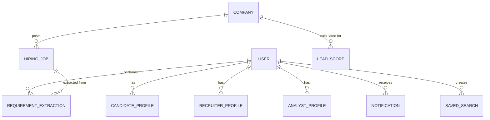

# 🗄️ Database Schema & Data Models

This document provides a comprehensive overview of the MongoDB data models used in the **AI Agentic Hiring Intelligence System**. The system uses 16+ interlinked schemas to manage users, autonomous crawling data, AI extractions, and predictive analytics.

---

## 🔐 1. Core Authentication & Users

### User Model
The central model for all actors in the system.
- **Fields**: `fullName`, `email`, `password` (hashed), `role` (`admin`, `recruiter`, `analyst`, `user`), `isActive`, `isEmailVerified`, `refreshToken`.
- **Logic**: Implements Bcrypt password hashing and JWT token management.

---

## 👤 2. Role-Based Profiles

### CandidateProfile
Stores specific metadata for job seekers.
- **Fields**: `userId` (Ref: User), `skills` (Array), `experienceLevel`, `currentSalary`, `expectedSalary`, `preferredLocations`, `resumeUrl`, `isActivelyLooking`.

### RecruiterProfile
Stores metadata for recruitment professionals.
- **Fields**: `userId` (Ref: User), `companyName`, `designation`, `hiringFocus`, `linkedInUrl`, `isVerifiedRecruiter`.

### AnalystProfile
Metadata for market analysts.
- **Fields**: `userId` (Ref: User), `expertise` (Array), `focusIndustries`.

---

## 🤖 3. Hiring Intelligence (AI-Driven)

### RequirementExtraction
Stores AI-processed data from unstructured job descriptions.
- **Fields**: `userId`, `jobId`, `rawDescription`, `extractedData` (Object: `role`, `skills`, `experience`, `location`, `salary`, `education`, `responsibilities`), `aiProvider` (`gemini`, `openai`), `processingStatus`.
- **Purpose**: Powering the "AI Resume Scrutinizer" and "Requirement Extraction" modules.

### LeadScore
Predictive scoring for company hiring signals.
- **Fields**: `companyId` (Ref: Company), `score` (0-100), `breakdown` (AI reasoning object).
- **Logic**: Calculated based on hiring velocity, stability, and tech stack demand.

### Trend
Aggregated market intelligence.
- **Fields**: `industry`, `growthPercentage`, `topSkills`, `hiringVelocity`, `period` (Month/Year).

---

## 💼 4. Job & Company Data

### HiringJob (The Master Job Table)
The core repository for all crawled and manual job postings.
- **Fields**: `source` (LinkedIn, Indeed, etc.), `sourceUrl`, `companyName`, `jobRole`, `requiredSkills`, `experienceRequired`, `hiringLocation`, `salary`, `jobDescription`, `hash` (for deduplication).
- **Indexes**: Optimized for full-text search on `jobRole` and `companyName`.

### Company
Central intelligence for organizations.
- **Fields**: `companyName`, `website`, `industry`, `companySize`, `hiringScore`, `trend`, `description`.

### Job
A lighter version used for specific matching tasks.
- **Fields**: `title`, `company`, `location`, `description`, `postedAt`.

---

## 📈 5. Operations & Engagement

### OutreachLog
Tracks recruiter interactions with potential leads.
- **Fields**: `recruiterId`, `candidateId`/`companyId`, `channel` (Email, LinkedIn), `status`, `messageContent`.

### Notification
System-wide alerts for users.
- **Fields**: `userId`, `title`, `message`, `type` (`info`, `success`, `warning`, `error`), `isRead`.

### SavedSearch
User-defined filters for recurring hiring insights.
- **Fields**: `userId`, `name`, `filters` (Object), `lastRun`.

### Report
Generated analytics exports.
- **Fields**: `userId`, `type` (PDF, Excel), `dataUrl`, `status`.

---

## 📄 6. Document Management

### Resume
Metadata for uploaded candidate resumes.
- **Fields**: `userId`, `fileUrl`, `parsedSkills`, `embeddingId` (for vector search), `compatibilityScores`.

---

## 🗺️ Relationship Diagram (Conceptual)

---
© 2026 AI Agentic Hiring Intelligence. Data Architecture.
